# Crosswalk — enterprise commercial architecture

Status: **plan + implementation record**. Written before the enterprise build (Sept 2026),
kept current as phases land. Read `ARCHITECTURE.md` first for the cross-reference
engine; this document covers everything commercial that sits on top of it.

The commercial model the whole system serves:

```
competitor item → approved cross (published crosswalk version) → our SKU
   → applicable contract hierarchy (list → GPO tier → account contract)
   → competitor market price (observations, decayed, aggregated)
   → recommended price (policy: floor, target, strategy)      ─┐
   → proposed price (rep / scenario)                            │ proposal (versioned snapshot)
   → approval (authority by role, below-floor workflow)        ─┘
   → contractual quote (locked, exported, pushed to CRM)
   → actual purchases → compliance → analytics → next recommendation
```

---

## 1. Current state (v0.3) — what is there and what blocks enterprise pricing

| Area | Today | Verdict |
| --- | --- | --- |
| Catalog | `OwnProduct` (SKU, description, category = product family, GUDID enrichment, attribute bin, `listPrice`, `cogs`, `currency`) | Keep. `listPrice`/`cogs` are single floats on the SKU — the assumption to remove. |
| Pricing | `Pricebook` (name, currency) + `PriceEntry` (pricebook × product → `price` float). Requests pick one pricebook. | Keep the models, evolve them: entries become effective-dated and scoped (contract / account / GPO / tier / volume). One global pricebook is no longer assumed. |
| Cross-reference | `KnownCross` (ownSku, competitor code, matchType, preferredOwnSku, source = sheet, `isActive`) + the resolution/binning/grading pipeline producing `MatchCandidate` per `RequestLine`. | Keep as the *intelligence* layer. Add governance (approval, clinical review, equivalence level, versions, publishing). |
| Account | `Request.accountNumber / accountName / accountType` — strings on the request. | Replace with an `Account` aggregate (parent/IDN, GPO memberships, external CRM ids); the request keeps a link. |
| Opportunity / deal | none | Add `Opportunity` (CRM-owned) and `Proposal` (ours). |
| Proposal / quote | `buildContractOfferWorkbook` renders the selected lines of a request straight to xlsx/Sheets. No persisted quote. | Add versioned `Proposal` + snapshot lines; the export becomes a rendering of an approved proposal version. |
| Review workflow | `RequestLine.reviewed`, `selectedCandidateId`, `overrideNote` | Keep for the cross-reference step; the approval workflow for *pricing* attaches to proposal lines. |
| Audit | none (run log per request; `LlmCall` for model calls) | Add `AuditEvent`. |
| Users / roles | none (single implicit user) | Add `User`, roles, permissions, server-side authorization; SSO behind an adapter. |
| Product families | `OwnProduct.category` strings ("Synthetic Mesh", "Trocar Products"…) + bin `family` | Keep the string; pricing policies key on it. |
| Margin | `scoreCandidates` uses `unitPrice`/`cogs` only for *ranking*; no margin figures are shown or stored. Money is `Float`. | Replace with a `Money`/`Decimal` module and one authoritative economics implementation. |
| Analytics | eval script (top-1/top-3 vs curated crosses) | Add outcome/decision models and analytics APIs. |
| Import/export | intake (xlsx/csv/Sheets), pricing import, competitor-sizes import, xref + offer exports, Drive write-back | Keep; add provenance (`Document`) and the new imports (observations, contracts, purchases). |
| Integrations | Google Sheets/Drive; openFDA | Add CRM/ERP/GPO adapter boundaries. |

**Debt that would break enterprise pricing if left alone**

1. `Float` money everywhere (`listPrice`, `cogs`, `PriceEntry.price`, `unitPrice`, `extended`). Contractual arithmetic must be decimal; the CSV rounding bug in REQ-0013 was the first symptom.
2. One `cogs` per SKU with no plant/region/date.
3. One pricebook per request; no effective dates, no account or GPO scope, no explanation of which price applies.
4. Cross-reference verdicts are mutable (`KnownCross.isActive`, re-runs); a quote's cross could change under it.
5. No identity — nothing records who priced, approved or exported.
6. Offer export is unconditional.

---

## 2. Domain model

Bounded contexts (one app, one schema, clear module boundaries under `src/lib/`):

```
catalog/        OwnProduct, StandardCost, ExchangeRate              (ERP is system of record for SKU + cost)
xref/           KnownCross (+ governance), CrosswalkVersion(+Entry)   (product marketing / clinical own it)
intelligence/   Competitor, CompetitorPriceObservation, summaries    (append-only evidence)
accounts/       Account, Gpo, GpoMembership, Opportunity             (CRM is system of record)
contracts/      Contract, ContractScope, PriceEntry, Commitment, RebateSchedule, BundleTerm
pricing/        PricingPolicy (versioned), resolution + recommendation engines
proposals/      Proposal, ProposalLine, Scenario, ScenarioLine       (this platform is system of record)
approvals/      ApprovalRequest, authority resolution
compliance/     PurchaseRecord, commitment status
analytics/      DealOutcome, MatchDecision, read models
integrations/   ExternalRef, SyncLog, Document; adapters crm/erp/gpo
auth/           User, UserRole, permissions, AuthProvider
audit/          AuditEvent
```

### 2.1 Money and time

* Every monetary column is `Decimal` (Prisma `Decimal`, decimal.js at runtime) with an
  explicit `currency` column beside it. `src/lib/money.ts` is the only arithmetic entry
  point (add, multiply by quantity, percentages, rounding to the currency's minor unit,
  comparison). Nothing in the UI computes money.
* Effective dating: `effectiveFrom` / `effectiveTo` (nullable = open) on prices, costs,
  memberships, policies, crosswalk versions, contracts. Resolution functions take an
  `asOf` date; nothing reads "current" implicitly.
* Snapshots: proposals copy every input they depended on (prices, cost basis, competitor
  price + confidence, recommendation, floor, policy version id, crosswalk version id).
  Historical proposals never re-read live tables.
* No silent FX. `ExchangeRate(from, to, rate, asOf, source)` exists; conversion is an
  explicit step that records the rate id used. Mixed-currency rollups report per currency
  unless a conversion is requested.

### 2.2 Entities (new or changed)

**Identity** — `User(id, email, name, isActive, externalId)`, `UserRole(userId, role)`.
Roles: `SALES_REP, REGIONAL_MANAGER, CONTRACTING_MANAGER, PRICING_ANALYST, PRICING_DIRECTOR,
PRICING_COMMITTEE, PRODUCT_MARKETING, CLINICAL_REVIEWER, FINANCE, ADMIN, EXECUTIVE`.
Permissions (code constant, tested): `view_pricing, edit_proposed_pricing,
edit_contract_pricing, view_cost, view_margin, approve_discount, approve_below_floor,
manage_crosswalk, publish_crosswalk, manage_contracts, import_competitor_pricing,
export_proposals, configure_pricing_rules, manage_users, view_analytics`.
Discount *authority* (how deep each role may go) lives in the versioned pricing policy,
not in code.

**Accounts** — `Account(id, name, accountNumber, parentAccountId, type SOLD_TO|SHIP_TO|IDN|HEALTH_SYSTEM|GROUP,
territory, segment, region, country, currency, isStrategic, ownerUserId, externalCrmId)`,
`Gpo(id, name, code)`, `GpoMembership(accountId, gpoId, tier, effectiveFrom, effectiveTo, source, verifiedAt, verifiedBy)`,
`Opportunity(id, accountId, name, stage, ownerUserId, closeDate, amount, currency, externalCrmId)`.

**Contracts** — `Contract(id, contractNumber, name, type LIST|GPO|IDN|LOCAL|NATIONAL, status DRAFT|ACTIVE|EXPIRED|TERMINATED|SUPERSEDED,
accountId?, parentAccountId?, gpoId?, tier, currency, effectiveFrom, effectiveTo, precedence,
committedVolume, committedValue, renewalJson, priceProtectionJson, escalationJson, notes,
sourceSystem, externalId, ownerUserId)`.
`ContractScope(contractId, productFamily?, productId?)` — applicability (none = all).
`PriceEntry` (evolved): `pricebookId?` (legacy list books), `contractId?`, `productId`,
`price Decimal, currency, effectiveFrom, effectiveTo, tier, minQty, maxQty, volumeTierName,
source, status ACTIVE|PENDING|EXPIRED, approvalState`.
`ContractCommitment(contractId, productFamily?, productId?, committedUnits, committedValue, periodStart, periodEnd)`.
`RebateSchedule(contractId, type VOLUME|GROWTH|COMPLIANCE|FAMILY|BUNDLE, basis UNITS|VALUE|COMPLIANCE_PCT|GROWTH_PCT,
productFamily?, tiersJson [{threshold, rebatePct?, rebateAmount?}], periodMonths)`.
`BundleTerm(contractId, name, description, conditionJson, benefitJson)` — e.g. condition
`{family:"Trocar Products", minUnits:5000}` → benefit `{family:"Surgical Stapling Products", pricePct:-5}`.
Price protection / escalation are structured JSON with a fixed schema (`kind FIXED_YEARS|MAX_ANNUAL_PCT|CPI|SCHEDULED|PRICE_MATCH`, parameters) validated by zod.

**Cost** — `StandardCost(productId, plant?, region?, currency, costType STANDARD|LANDED|TRANSFER, cost Decimal, effectiveFrom, effectiveTo, source)`.
`OwnProduct.cogs` remains as the fallback "global standard cost" and is backfilled into a
`StandardCost` row (region null) by the migration.

**Competitive intelligence** — `Competitor(id, name, aliasesJson)`,
`CompetitorPriceObservation(id, competitorId, competitorSku, competitorProductId?, price Decimal, currency, uom,
accountId?, gpoId?, region?, observedAt, effectiveAt?, sourceType, sourceRef, documentId?, enteredByUserId,
rawConfidence, verificationStatus UNVERIFIED|VERIFIED|DISPUTED, verifiedByUserId, verifiedAt, notes, proposalLineId?)`.
Append-only: rows are never updated except verification fields. Source types ranked:
`CUSTOMER_INVOICE > CUSTOMER_PO > CUSTOMER_BID_FILE > GPO_CONTRACT_FILE > WIN_LOSS_RECORD > INTERNAL_VERIFIED > REP_OBSERVED > ANECDOTAL`.

**Pricing policy** — `PricingPolicy(id, productFamily ("*" = default), version, status DRAFT|ACTIVE|SUPERSEDED,
targetMarginPct, minMarginPct, floorMethod COST_PLUS_MIN_MARGIN|PCT_OF_LIST|FIXED, floorParamsJson,
defaultStrategy, defaultAdjustmentPct, classification COMMODITY|DIFFERENTIATED, strategicImportance 1..5,
authorityJson {role: maxDiscountFromListPct}, approvalRulesJson, effectiveFrom, createdByUserId)`.
Activating a new version supersedes the previous one; proposals pin the version id they used.

**Proposals** — `Proposal(id, reference, version, parentProposalId?, requestId?, accountId, opportunityId?,
gpoIdSnapshot, contractIdSnapshot, currency, status DRAFT|APPROVAL_REQUIRED|SUBMITTED|PARTIALLY_APPROVED|APPROVED|REJECTED|CHANGES_REQUESTED|EXPIRED|WON|LOST,
validThrough, ownerUserId, policyVersionsJson, crosswalkVersionId, economicsJson, lockedAt, submittedAt, decidedAt, outcomeJson)`.
`ProposalLine(id, proposalId, lineNo, competitorCode, competitorDescription, competitorProductId?, competitorId?,
crossId?, equivalenceLevel, crosswalkVersionId, productId?, sku, description, productFamily, quantity, uom,
listPrice, contractPrice, waterfallJson, competitorPrice, competitorPriceConfidence, competitorPriceBasis,
cost, costBasisJson, floorPrice, targetPrice, ceilingPrice, recommendedPrice, recommendationJson,
proposedPrice, marginAmount, marginPct, discountFromListPct, discountFromContractPct, approvalState, requiredAuthority, notes, included)`.
`Scenario(id, proposalId, name, kind RECOMMENDED|AGGRESSIVE|MARGIN_OPTIMIZED|CUSTOMER_REQUESTED|CUSTOM|FINAL, createdByUserId)`,
`ScenarioLine(scenarioId, proposalLineId, proposedPrice)`. Scenarios never touch the proposal's own prices;
"apply scenario" copies prices into an unlocked proposal (audited).

**Approvals** — `ApprovalRequest(id, proposalId, proposalLineId?, requiredRole, reason, notes, requestedByUserId, requestedAt,
status PENDING|APPROVED|REJECTED|CHANGES_REQUESTED|WITHDRAWN|EXPIRED, decidedByUserId, decidedAt, decisionComments, snapshotJson, policyVersionId)`.

**Audit** — `AuditEvent(id, at, actorUserId, entityType, entityId, action, beforeJson, afterJson, reason, contextJson)`.
Price changes record previous/new price, recommendation, floor, margin and policy version in `contextJson`.

**Crosswalk governance** — `KnownCross` gains `approvalStatus DRAFT|IN_REVIEW|APPROVED|REJECTED|RETIRED,
clinicalReviewStatus, marketingReviewStatus, equivalenceLevel EXACT|FUNCTIONAL|CLOSEST_ALTERNATIVE|PREMIUM_ALTERNATIVE|PARTIAL_SUBSTITUTE|NONE,
approvedUsage, justification, evidenceJson, reviewerUserId, approvedByUserId, approvedAt, effectiveFrom, effectiveTo, version`.
`CrosswalkVersion(id, number, status DRAFT|IN_REVIEW|PUBLISHED|SUPERSEDED|RETIRED, publishedAt, publishedByUserId, notes)`,
`CrosswalkVersionEntry(versionId, knownCrossId, ownSku, competitorCodeNorm, matchType, equivalenceLevel, approvedUsage)` — the frozen copy.

**Compliance** — `PurchaseRecord(id, accountId, productId?, sku, quantity, netPrice, currency, invoiceDate, contractId?, proposalId?, source, externalId, documentId?)`.
Commitment status is computed (service) and cached in `Contract.performanceJson`.

**Analytics** — `DealOutcome(proposalId, outcome WON|LOST|NO_DECISION, competitorId?, priceReason, commercialReason, decidedAt, finalValue)`,
`MatchDecision(id, requestLineId?, proposalLineId?, topRecommendedSku, chosenSku, acceptedTop, overrideReason, productFamily, competitorName, confidence, decidedByUserId, at, groundTruth VALIDATED_CORRECT|VALIDATED_INCORRECT|UNKNOWN)`.

**Integrations** — `ExternalRef(entityType, entityId, system, externalId, syncedAt, syncHash)`,
`SyncLog(id, system, direction IN|OUT, entityType, entityId, externalId, status, attempt, error, payloadHash, at)`,
`Document(id, kind INVOICE|PO|BID_FILE|CONTRACT|COMPETITOR_LIST|OTHER, filename, mimeType, storagePath, uploadedByUserId, uploadedAt, extractedJson, extractionConfidence, notes)`.

---

## 3. Migrations (as implemented)

Dev chose **PostgreSQL on Neon** for this build, so the SQLite migration line ended at v0.3
(`prisma/migrations-sqlite-v0.3/`, kept for reference) and a fresh Postgres history starts:

1. `20260914200000_postgres_baseline` — the v0.3 models on Postgres with money as `Decimal(18,4)`.
2. `20260914210000_enterprise_platform` — every enterprise model above (30 tables) and the
   `PriceEntry` / `KnownCross` / `OwnProduct` / `Request` evolutions, in one additive migration
   (the phases were built against one schema; splitting a fresh history per phase would only
   add ceremony).

Two ways to apply: `npx prisma migrate deploy` (TCP) or `npm run db:migrate:http`
(`scripts/migrate-http.ts`, same files over Neon's HTTPS driver for sandboxes without
outbound TCP; it records `_prisma_migrations` identically).

Backfill (`prisma/seed-enterprise.ts`, idempotent; `--no-demo` for production): dev users
for every role; `OwnProduct.cogs` → global `StandardCost` where no dated cost exists;
requests with an account number → `Account`; the `*` policy plus per-family policies;
curated `KnownCross` rows → APPROVED with equivalence from match type; crosswalk **v1
published**. With demo data: MSK under an IDN parent, Premier Tier 2 membership, the GPO
contract (24 % off list, banded stapler reloads, value rebate), the MSK local mesh
agreement (two overrides, a commitment, a bundle term), plant/global standard costs,
purchases, 19 competitor price observations across three hospitals, an EUR→USD rate.

---

## 4. Backend / service architecture

`src/lib/<context>/` modules export pure functions (no Prisma) for every calculation and
thin repository/service functions (Prisma) that load inputs and persist results. API routes
and server components call services; they never compute money.

* `money.ts` — `Money` helpers over `Decimal`.
* `auth/` — `AuthProvider` (dev provider: signed cookie chosen from the sidebar's
  *development sign-in*; SSO provider is an interface + documented adapter), `getActor()`,
  `requirePermission(actor, perm)`, `can(actor, perm)`, role→permission matrix.
* `contracts/resolve.ts` — `resolvePrice({productId, accountId, asOf, quantity})` → waterfall.
* `catalog/cost.ts` — `resolveCost({productId, asOf, plant?, region?})`.
* `intelligence/` — `recordObservation`, `summarize({competitorSku, accountId, gpoId, region, asOf})`.
* `pricing/policy.ts`, `pricing/recommend.ts` — pure engine, one function, fully tested.
* `proposals/` — `createFromRequest`, `refreshLine`, `economics(lines)`, `scenarios`.
* `approvals/` — `requiredAuthority(line, policy)`, `route`, `decide`, `lockState(proposal)`.
* `audit.ts` — `record(actor, entity, action, before, after, reason, context)`.
* `xref/governance.ts` — approve, publish, supersede, retire, `currentPublished()`.
* `compliance/` — `commitmentStatus(contract)`, `conversion(proposal)`.
* `analytics/` — read-model queries.
* `integrations/{crm,erp,gpo}/` — `Adapter` interfaces, `DevAdapter` (fixture-backed, labelled), `SalesforceAdapter` / `SapAdapter` skeletons that throw `NotConfigured` with the list of credentials needed; `sync.ts` (idempotent upsert by ExternalRef + payload hash, retries, SyncLog).

## 5. Pricing-engine architecture

**Resolution (deterministic).** Inputs: product, account (→ parent, GPO memberships as of
date), asOf, quantity, currency. Steps: (1) List = `OwnProduct.listPrice` or the active
LIST pricebook entry; (2) GPO = active `Contract(type=GPO)` for a GPO the account is a
member of on asOf, with an in-scope, effective `PriceEntry` whose quantity band contains
the quantity; (3) IDN = parent-account contract; (4) LOCAL = account contract. Precedence:
higher `Contract.precedence` wins, then more specific scope (account > IDN > GPO > list),
then later `effectiveFrom`. Output: `{applicablePrice, source, steps:[{level, price, contract, entry, reason}], explanation}`.
Every step, including the ones that lost, is in the explanation.

**Cost.** Most specific effective `StandardCost` (plant > region > global) in the pricing
currency; otherwise `OwnProduct.cogs`; otherwise null (margin unknown, never zero).

**Recommendation (deterministic rules, explainable).** Given list, contract price, cost,
policy (target/min margin, floor method, strategy, adjustment), competitor summary
(price, basis, confidence), deal context (strategic account, bundle flags, user
objective): compute `floor`, `target = max(cost/(1-targetMargin), …)`, `ceiling =
competitor reference` when basis is KNOWN_ACCOUNT/MARKET_ESTIMATE with confidence ≥ 0.4,
then apply the strategy (`MATCH`, `UNDERCUT_AMOUNT`, `UNDERCUT_PCT`, `HOLD_PREMIUM`,
`PRESERVE_CONTRACT`, `STRATEGIC_DISCOUNT`, `PENETRATION`), clamp to `[floor, contract or list]`,
and derive discount %, margin %, margin $, required authority, confidence, and a
one-paragraph explanation built from the actual numbers. Statistical/AI assistance
(e.g. win-probability) is an optional input, never the rule.

## 6. Approval workflow

`requiredAuthority(line)`: discount from list vs `policy.authorityJson` bands →
lowest role whose band covers it; below floor → `PRICING_COMMITTEE` (configurable);
extra rules from `approvalRulesJson` (deal value, strategic account, contract duration,
family). If the actor's highest role ≥ required, the line is auto-approved at proposal
submission; otherwise an `ApprovalRequest` is created with a snapshot. Proposal status
derives from its requests. `lockState` blocks export/finalise while any request is
pending/rejected. Decisions and every price change write `AuditEvent`.

## 7. Integration architecture

Ownership: **ERP** = SKU master, list price, standard cost, purchase history;
**CRM** = account, parent, opportunity, contact, rep, territory, GPO affiliation (if
stored), strategic flag; **GPO feed** = membership; **Crosswalk** = crosswalk versions,
observations, policies, proposals, recommendations, approvals, outcomes.
Adapters are pull/push functions returning domain DTOs; `sync.ts` upserts by
`ExternalRef` with payload hashing (idempotent), retries with backoff, and writes `SyncLog`.
Outbound quote push happens on approval (and on demand). Webhooks land in
`/api/integrations/<system>/webhook` and enqueue the same sync functions.

## 8. UI

* **Proposal workspace** `/proposals/[id]` — sticky deal summary (contract value, customer
  savings, gross profit, blended margin, share of wallet, approval status); the line table
  (Competitor item · Cross · Qty · Competitor price · Current price · Recommended ·
  Proposed · Floor · Margin · Approval); inline proposed-price editing with instant
  economics; line drawer with tabs *Cross evidence · Competitor prices · Waterfall · Cost
  basis · Recommendation · Approvals*; scenario switcher; submit / approve / export.
  Cost and margin columns render only with `view_cost` / `view_margin`.
* **Approvals** `/approvals` — queue for approvers.
* **Contracts** `/contracts`, `/contracts/[id]` — entries, scope, commitments, rebates, bundles, clauses, performance, renewal alerts.
* **Accounts** `/accounts/[id]` — hierarchy, GPO memberships, contracts, proposals, purchases.
* **Competitive intelligence** `/intelligence` — observations, summaries, import, verify.
* **Pricing policies** `/settings/pricing` — versioned policy editor (admin).
* **Crosswalk** `/crosses` — governance columns, versions, publish.
* **Analytics** `/analytics` — win/loss, pricing, conversion, acceptance.
* **Development sign-in** in the sidebar (dev auth provider only).

Progressive disclosure: rep sees decisions; analyst toggles detail; admin sees policy; exec sees analytics.

## 9. Analytics data model

Facts: `Proposal` (+lines, snapshots), `DealOutcome`, `ApprovalRequest`, `MatchDecision`,
`CompetitorPriceObservation`, `PurchaseRecord`. Read models are SQL over these; no
separate warehouse in v1. "Rep acceptance rate" (`MatchDecision.acceptedTop`) is reported
separately from "validated accuracy" (`groundTruth`).

## 10. Security and audit

Server-side authorization on every service entry point; API routes resolve the actor
first. Cost/margin are stripped from responses without `view_cost`/`view_margin`.
`AuditEvent` on price changes, approvals, publishes, contract edits, exports, outcome
entry. Sensitive data (prices, costs, contracts, observations) is only readable by
authenticated roles. Dev auth is unmistakably labelled and disabled when an SSO provider
is configured.

## 11. Migration / backfill strategy

Additive migrations; `scripts/backfill-enterprise.ts` is idempotent and safe to re-run;
existing requests, candidates and exports keep working (the request pipeline is untouched
except for the new "Create proposal" step). Float columns become Decimal in one migration
with SQLite table rebuilds handled by Prisma.

## 12. Phases and dependencies

1 foundation → 2 intelligence → 3 policy/recommendation → 4 proposals/economics/scenarios
→ 5 deal desk → 6 contract mechanics → 7 crosswalk governance → 8 integrations → 9
compliance → 10 analytics. All ten landed in this build (v0.4). Tests: pure engines in
`scripts/check-enterprise.ts` (21 cases, no DB); the full commercial workflow in
`scripts/test-enterprise.ts` (15 steps against the database, the deal fixture of §13).

---

## 13. Implementation record (v0.4)

### ER / domain model

```mermaid
erDiagram
  User ||--o{ UserRole : has
  Account ||--o{ Account : parent
  Account ||--o{ GpoMembership : member
  Gpo ||--o{ GpoMembership : has
  Account ||--o{ Opportunity : has
  Account ||--o{ Contract : local
  Gpo ||--o{ Contract : gpo
  Contract ||--o{ PriceEntry : prices
  Contract ||--o{ ContractScope : scope
  Contract ||--o{ ContractCommitment : commits
  Contract ||--o{ RebateSchedule : rebates
  Contract ||--o{ BundleTerm : bundles
  Pricebook ||--o{ PriceEntry : legacy
  OwnProduct ||--o{ PriceEntry : sku
  OwnProduct ||--o{ StandardCost : cost
  Competitor ||--o{ CompetitorPriceObservation : observed
  Account ||--o{ CompetitorPriceObservation : at
  Document ||--o{ CompetitorPriceObservation : evidence
  PricingPolicy }o--|| ProposalLine : pinned
  Request ||--o{ Proposal : from
  Account ||--o{ Proposal : for
  CrosswalkVersion ||--o{ Proposal : pinned
  CrosswalkVersion ||--o{ CrosswalkVersionEntry : frozen
  KnownCross ||--o{ CrosswalkVersionEntry : source
  Proposal ||--o{ ProposalLine : lines
  Proposal ||--o{ Scenario : whatif
  Scenario ||--o{ ScenarioLine : prices
  Proposal ||--o{ ApprovalRequest : approvals
  Proposal ||--o| DealOutcome : outcome
  ProposalLine ||--o{ MatchDecision : decided
  Account ||--o{ PurchaseRecord : buys
  Contract ||--o{ PurchaseRecord : under
  AuditEvent }o--|| User : actor
  ExternalRef }o--|| SyncLog : logs
```



### The end-to-end scenario, as it runs today
A hospital list is imported (`/requests/new`) → cross-referenced with the published crosswalk
(`runRequest`) → **Create proposal** builds `PRP-…` for the request's account: the waterfall
resolves list → GPO tier → local per line, cost by plant/region, competitor intelligence is
summarised per code with a basis, the policy recommends a price and names the authority it
needs, deal economics roll up → the rep edits prices and excludes what cannot be priced →
**Submit** auto-approves what is within the submitter's authority and routes the rest to the
deal desk → approvers decide; the proposal is locked meanwhile → export and CRM push open
only when `canFinalize` is true → **Record outcome** WON creates the local contract and
commitments → purchases (ERP feed / import) drive conversion and commitment status →
analytics read the facts. `scripts/test-enterprise.ts` walks exactly this path.

### Architectural decisions
* **Postgres (Neon) from day one** — Dev's call; the local SQLite line is retired. Two adapters (`pg` over TCP, `neon-ws` over WebSocket) share one `DATABASE_URL`.
* **Decimal everywhere, one arithmetic module.** `src/lib/money.ts` is the only place money is computed; the UI formats strings.
* **Snapshots, not joins, for proposals.** A proposal line copies every input; live tables change freely.
* **Incremental discount authority.** Authority bands apply to the discount below the customer's current contract price (else list). The first draft measured from list and routed every GPO-priced line for approval — the fixture caught it.
* **Governed crosswalk = published versions.** The engine's verdicts stay advisory; only published entries are "equivalents".
* **Dev adapters, not mocks.** Integrations are interfaces + fixture adapters labelled "dev"; the Salesforce/SAP skeletons refuse to run without credentials.
* **Policies are data.** Margins, floors, strategies, authority and approval rules are versioned rows; the code only evaluates them.
* **Authorization is server-side and redacting.** Every route resolves the actor; cost/margin fields are stripped for roles without `view_cost`/`view_margin`.

### Remaining risks and open items
1. **SSO is an adapter contract, not an implementation** — until it is wired, the dev sign-in is the only identity, which is fine for a demo and unacceptable for a pilot.
2. **Salesforce / SAP / GPO feeds are skeletons** (see INTEGRATIONS.md for the credential list). Everything upstream of them runs on fixtures.
3. **Runs and syncs are in-process**; a queue (pg-boss) is still needed before multi-user load.
4. **Policy authority bands are single-dimensional** (discount %). Rules cover margin/value/strategic/duration; per-family absolute-price floors by region are not modelled.
5. **FX is manual**; no rate feed. Mixed-currency proposals are reported per currency and not converted.
6. **Tax** is deliberately out of the pricing engine; the `Proposal.currency` + per-line currency design leaves room for a jurisdiction layer at quote rendering.
7. **Analytics are computed on read** — fine at hundreds of proposals, needs materialised views at tens of thousands.
8. **Ground-truth accuracy** requires reviewers to set `MatchDecision.groundTruth`; the dashboard shows "n/a" until they do.
9. **Cross-reference identity products** can create SKU variants (e.g. `ABSTACK30` from a contains-match) that carry no price; the workspace flags them and the rep excludes them — a catalog-hygiene rule (map to the canonical SKU) is the proper fix.

### Role review — can each role do the job without a spreadsheet?
* **Sales rep** — imports the list, sees a decision-oriented workspace (no cost, no margin), edits prices, sees which lines need whom, submits, exports the approved quote, records the outcome. Yes.
* **Regional manager** — deal-desk queue for lines in their authority, margin visible, approves with comments. Yes.
* **Pricing analyst** — full economics, cost basis, waterfall, intelligence with decay, verification of observations, imports. Yes; cannot approve (by design).
* **Contracting director / manager** — contracts, entries, commitments, rebates, bundles, renewal pipeline, compliance, integration syncs. Yes.
* **Product marketing** — review queue, equivalence levels, publish versions. Yes.
* **Clinical affairs** — clinical review status on crosses. Yes (narrow by design).
* **Finance** — cost/margin visibility, analytics, purchase imports. Yes; cannot price.
* **IT / integration engineering** — adapter interfaces, sync logs, `ExternalRef`, HTTP migration path, CI with Postgres. Yes, with the credential list in INTEGRATIONS.md as the backlog.
